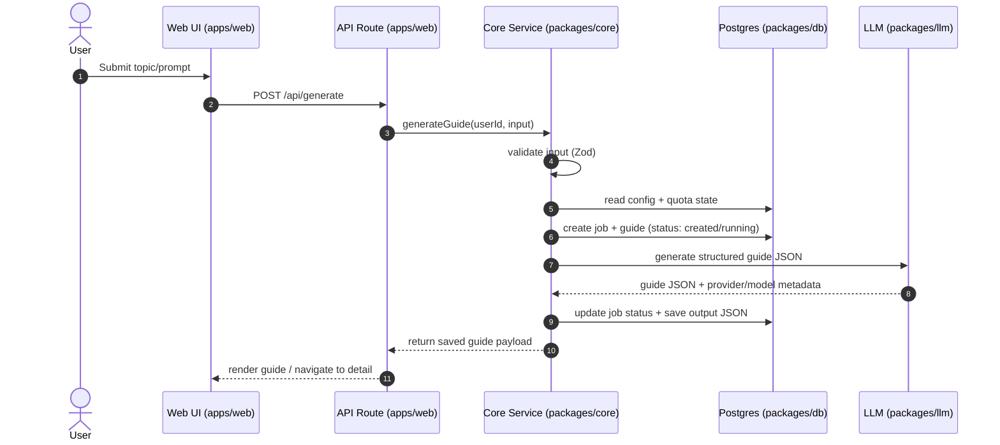

# Learnin10 — Architecture & Codebase Structure

> Scope: documents the **current scaffold** in this repo and the **target MVP architecture** described in `PRD.md` (evolution-ready, async-worker compatible).

## Tech Stack (Current)

- **Framework:** Next.js 14 (App Router)
- **Language:** TypeScript
- **UI:** Tailwind CSS + shadcn/ui primitives
- **DB/ORM:** PostgreSQL via Drizzle ORM
- **DB Driver:** Neon serverless HTTP (`@neondatabase/serverless` + `drizzle-orm/neon-http`)
- **Env validation:** `@t3-oss/env-nextjs` + Zod

## Repository Structure (Current)

Top-level (non-exhaustive):

- `src/` — application source
- `public/` — static assets
- `drizzle.config.ts` — Drizzle config
- `tailwind.config.ts`, `postcss.config.cjs`, `src/styles/globals.css` — styling
- `next.config.js` — Next.js configuration
- `src/env.js` — runtime environment variable validation

### `src/` Layout

```
src/
  app/
    layout.tsx        # Root layout (global CSS import, metadata)
    page.tsx          # Home page (server component)
  components/
    search-form.tsx   # Client component (currently stub interaction)
    ui/               # shadcn/ui primitives (do not edit directly)
  env.js              # Env validation schema
  lib/
    utils.ts          # Shared utilities (e.g., cn())
  server/
    db/
      index.ts        # Drizzle DB client initialization
      schema.ts       # Drizzle schema (currently example `posts` table)
  styles/
    globals.css       # Tailwind + theme primitives
```

### Key Entry Points

- `src/app/layout.tsx`
  - Imports global styles from `src/styles/globals.css`
  - Defines document metadata and `<html lang="en">`

- `src/app/page.tsx`
  - Server component
  - Reads `posts` using Drizzle query API
  - Sets `export const dynamic = "force-dynamic"` (disables static caching for the route)

- `src/components/search-form.tsx`
  - Client component with local state
  - Currently does **not** submit to an API route; it displays a placeholder message

## Data Layer (Current)

### DB Client

`src/server/db/index.ts`:

- Loads `.env` via `dotenv/config` (development convenience)
- Creates a Neon SQL client from `process.env.DATABASE_URL`
- Exports `db = drizzle(sql, { schema })`

### Schema

`src/server/db/schema.ts`:

- Uses a `createTable()` helper to prefix tables with `learnin10_`
- Currently defines an example table:
  - `learnin10_post` (exported as `posts`)

## Runtime Architecture (Current)

Today, the app is a simple synchronous render:

1. Request hits Next.js route `/`
2. `src/app/page.tsx` executes on the server
3. It queries Postgres using Drizzle and renders results
4. Client-only behavior is limited to `SearchForm` state changes

## Target Architecture (PRD / Evolution-Ready MVP)

The PRD calls for introducing **strict service boundaries** so that synchronous guide generation can later move to async workers without refactoring the core workflow.

### Target Monorepo Layout

Planned structure (from `PRD.md` + `README.md`):

```
apps/
  web/    # Next.js app (UI + routes)
  docs/   # Astro Starlight docs
packages/
  auth/   # Clerk helpers and server-side guards
  core/   # Generation workflow service (validation → quota → job lifecycle)
  db/     # Drizzle schema + DB access utilities
  llm/    # Provider-agnostic LLM interface + adapters (OpenAI first)
```

### Dependency Rules

apps/* → may import from packages/*
packages/core → may import from db, llm, auth, types
packages/db → imports nothing internal
packages/llm → imports nothing internal
packages/auth → imports nothing internal

### Service Boundary Rules

- **No direct provider calls in route handlers.**
  - Web/API routes call `packages/core`.
  - `packages/core` calls `packages/llm`.
- **Authorization is server-side and deny-by-default.**
  - Every guide/job read/write is ownership-checked.
- **Persist model output as structured JSON, not raw HTML/Markdown.**
  - UI renders structured sections and code as text (no `dangerouslySetInnerHTML`).

### Core Generation Flow (Sync MVP)

Mermaid diagram (target):



### Data Model Requirements (MVP)

The PRD requires (minimum):

- `guides`
  - `userId` (Clerk)
  - `title`
  - `topic/prompt`
  - `outputJson` (structured sections)
  - timestamps

- `generation_jobs` (required; async-ready anchor)
  - 1:1 with `guides` (unique `guideId`)
  - `status`: `created | running | succeeded | failed`
  - provider/model, latency, timestamps
  - `quota_date_ist` (date derived in IST)
  - error category (validation/auth/quota/provider/etc.)
  - optional idempotency key (unique per `(userId, idempotencyKey)`)

- `app_config` (DB-backed runtime config)
  - quota, model, timeout, output limits
  - precedence: env hard caps > DB config > env defaults

### Security/Privacy Requirements (MVP)

- Ownership enforcement for every operation (no cross-user reads/writes)
- Server-side validation for input length and shape
- Output rendering must not allow raw HTML emitted by the model
- Errors returned to the UI must not leak internal details

### Performance/Scalability Intent

- Keep the **core service interface** stable so the execution model can evolve:
  - sync (today) → async worker + queue (future)
- The `generation_jobs` table provides the state machine for retries, polling, and observability.

## Notes

- This repo currently uses a single-app layout under `src/`. The monorepo layout above is the planned next step, not yet implemented.
